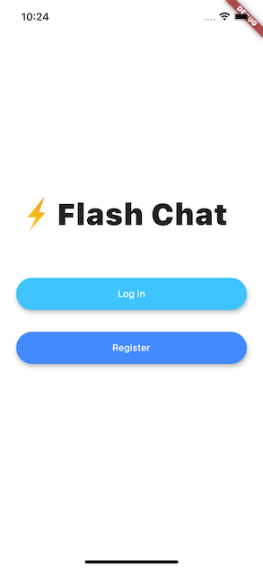
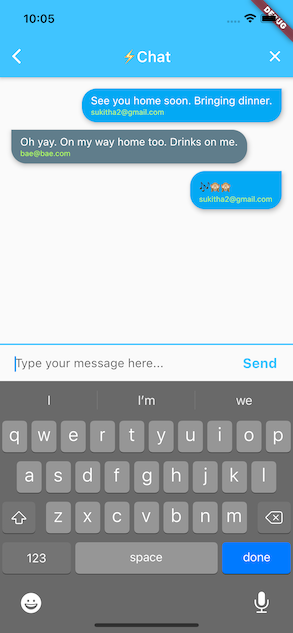

FlashChat is a cross-platform real-time messaging application built using Flutter and Firebase. The app enables users to sign up, log in securely, and send/receive messages instantly. It is designed to be responsive, smooth, and scalable, with a focus on learning Flutter's UI-building capabilities and integrating backend services with Firebase.

Key Features:

🔐 User Authentication: Integrated Firebase Authentication for secure user sign-up and login using email/password.

💬 Real-Time Chat: Messages are stored and retrieved from Cloud Firestore, enabling live chat updates across devices without refresh.

🧩 Animated UI: Used Hero animations, custom animation controllers, and Flutter widgets for a smooth user experience.

📱 Responsive UI: Designed using Flutter’s ListView, StreamBuilder, and state management to handle real-time updates.

🧪 Platform Tested: Successfully tested on both Android and iOS simulators for smooth performance.

Tech Stack:

Frontend: Flutter (Dart)

Backend: Firebase (Authentication + Cloud Firestore)

Tools: Android Studio, GitHub

Learning & Challenges:

Learned how to use Streams to handle live data and UI updates.

Understood the importance of Firebase security rules.

Improved skills in Flutter's state management and widget tree optimization.

Future Improvements:

Add group chat functionality.

Integrate push notifications using Firebase Cloud Messaging.

Implement image sharing and user profile customization.

# Screenshots
   
